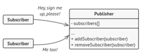

Observer is a behavioral design pattern that lets you define a subscription mechanism to notify multiple objects about any events that happen to the object they’re observing.

# Problem 🤯
Imagine you are running an e-commerce store. The customer is very interested in a particular brand of product (say, it’s a new model of the iPhone) which should become available in the store very soon.
The customer could visit the store every day and check product availability.
On the other hand, the store could send tons of emails (which might be considered spam) to all customers each time a new product becomes available. This would save some customers time.

But here is a problem, when product is available you are sending emails to all customers, some of them are not interested. You end up sending emails to them.

# Solution 🥳
Send emails to only those customers who are interested to it.
Customers interested in specific products subscribe to the e-commerce store's notification service. When a desired product, like the new iPhone model, becomes available, only subscribed customers are notified. This targeted approach ensures relevant updates without spamming uninterested customers.
